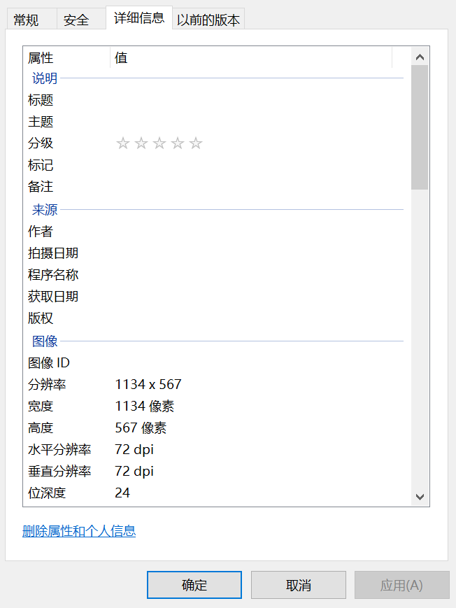

# 🤲 bookdash-cn

> [README-en](README-en.md) & [在线地址](https://forestlet.github.io/bookdash-cn)

## 项目说明

1. 本项目旨在翻译 [bookdash 中英文绘本](https://bookdash.org/books/?languages=en) 至中文，且遵循 [CC4.0](https://creativecommons.org/licenses/by/4.0/) 协议

2. 项目结构

   ```txt
   📂 asset                # 绘本文件
      📂 amazing-daisy     # 绘本故事《amazing-daisy》
      📂 ...
   📂 doc                  # 绘本列表
      📄 booklist.json
      📄 booklist.md
   📂 util                 # 工具类
   📂 img
   📂 web                  # 网页
   📝 README               # 说明
   📝 README-en            # 英文说明
   ```

3. 已翻译绘本列表 👉 [booklist](doc/booklist.md)

4. 如果您有什么意见和好的建议，可以提交新的 Issue

5. ☕ 如果您觉得这个项目不错的话，就 star ⭐ 一下好吧~

## 翻译规范

1. 翻译流程

   ```txt
   PPT 插入图片 -> 对照英文绘本翻译 -> 审核 —> 导出 PDF ->  -> 发布
   ```

2. 需要修改的文件

   1. [booklist.json](doc/booklist.json)
   2. [booklist.md](doc/booklist.md) 可在 `util` 文件夹内运行 `node transform.js` 直接生成

3. 文档规范

   - PPT 每页大小要为绘本图片大小

     PPT 自定义幻灯片大小

      

     查看绘本图片大小（英寸 = 像素/分辨率）

     如：分辨率 1134 × 567，72 dpi，则设置为 15.74 in × 7.875 in

      

   - 字体设置为“思源雅黑 Medium”

   - 行间距为 1.5

   - 字号为 24

4. 提交信息

   - 提交文件格式如下：

     ```txt
     📂 xxx
         📂 img         # 无文字图片
         📄 xxx_en.pdf  # 英文绘本 PDF 文件
         📄 xxx_cn.pdf  # 翻译后绘本导出的 PDF 文件
         📃 xxx_cn.pptx # 翻译后绘本 PPT 文件
         📄 xxx_cover   # 绘本封面
     ```

   - 同时将绘本相关信息添加到 [booklist.json](doc/booklist.json) 文件中：

     | 信息       | 含义                  |
     | ---------- | --------------------- |
     | book_cn    | 绘本对应中文名        |
     | contents   | 绘本内容              |
     | cover      | 绘本封面相对路径      |
     | file       | 绘本 PDF 文件相对路径 |
     | translator | 译者署名              |
     | date       | 绘本翻译完成日期      |
     | tags       | 绘本标签              |
     | src        | 绘本英文原链接        |

     如：

     ```json
     "amazing-daizy": {
        "book_cn": "了不起的黛西",
        "contents": "小鸡黛西住在一个小农场里，她希望自己能飞。其他鸡都嘲笑她每天的飞行练习。但有一天，惊人的事情发生了……",
        "cover": "amazing-daizy/amazing-daizy_cover.jpg",
        "file": "amazing-daisy_cn.pdf",
        "translator": "forestlet",
        "date": "2021.3.9",
        "tags": [
            "小鸡",
            "动物",
            "飞",
            "励志",
            "想象"
        ],
        "src": "https://bookdash.org/books/amazing-daisy-by-nozizwe-herero-siya-masuku-and-leona-ingram/"
     }
     ```

## 实现

1. [bootstrap](https://getbootstrap.com/)

2. [jQuery](https://jquery.com/)

3. todos

   - [x] 💾 下载
   - [x] 🤲 在线阅读
   - [x] 📖 页码
   - [ ] 🔍 搜索
   - [x] 🚀 在线页面
